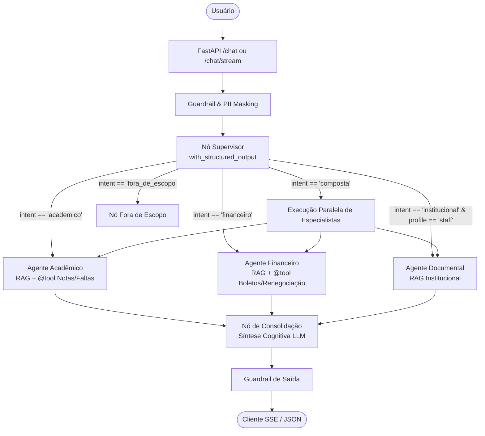

# AGENTS.md — UsiEdu: Diretrizes e Protocolos para Agentes de IA

> **Guia Executivo e Técnico para Agentes Autônomos e Engenheiros de IA.**
> Este arquivo define os padrões arquiteturais, convenções de código, papéis do sistema e protocolos de segurança e qualidade aplicados em todo o ecossistema **UsiEdu**.

---

## 1. Visão Geral do Projeto (UsiEdu)

O **UsiEdu** é uma plataforma multi-agente de suporte universitário orientada a **LangGraph**, **LangChain** e **RAG Híbrido** em nível de **Startup Global / Scale-up Enterprise**.

### Stack Tecnológico Principal:
- **Orquestração Multi-Agente:** LangGraph (`StateGraph`, `MemorySaver` / SQLite checkpointers, `with_structured_output`, `interrupt_before` para Human-in-the-Loop).
- **Recuperação & RAG:** Qdrant (Vetorial denso) + BM25 (Esparso léxico) + RRF (*Reciprocal Rank Fusion*) + Cross-Encoder Re-ranker (`sentence-transformers`).
- **Backend & Streaming:** FastAPI, Server-Sent Events (SSE via `astream_events(v2)`), JWT Auth com RBAC (`student` vs `staff`).
- **Qualidade & Observabilidade:** LangSmith Tracing, Framework Ragas (LLM-as-a-Judge), Pytest (>300 testes unitários) e Ruff Linter.
- **FinOps & AI Safety:** Semantic Cache em SQLite/Redis (similaridade de cosseno com threshold 0.92), poda de tokens (`trim_messages`), mascaramento de PII (`mask_pii`) e guardrails anti-injection.
- **Frontend:** React, Vite, TypeScript, Rich Markdown com botões de cópia de código e visualizador de fontes.
- **Infraestrutura:** Azure Container Apps, Bicep (IaC), GHCR, Docker, Scale-to-Zero.

---

## 2. Topologia dos Agentes no Grafo



---

## 3. Protocolos de Engenharia e Convenções

### 3.1 LangGraph & State Management
1. **Tipagem e Schemas:** Todas as decisões do supervisor e estados do grafo devem ser modelados tipicamente em [src/orchestration/state.py](file:///c:/Projetos/UsiEdu/src/orchestration/state.py).
2. **Saída Estruturada:** O nó Supervisor deve obrigatoriamente usar `with_structured_output(SupervisorDecision)` com fallback resiliente para parsing de JSON.
3. **Poda de Contexto:** Antes de enviar mensagens ao prompt de qualquer agente, o histórico deve ser tratado com `trim_messages` do LangChain para evitar estouro de tokens.

### 3.2 Ferramentas (@tool)
1. Todas as ferramentas acopladas aos agentes devem ser decoradas com `@tool` do LangChain, com tipos estritos e docstrings explicativas.
2. A factory do nó deve associar as ferramentas usando `bind_tools(tools)` nativo do modelo.

### 3.3 FinOps & Performance
1. Perguntas de escopo público/geral (`institucional`) devem consultar o Cache Semântico antes de acionar o grafo.
2. Consultas simples de agente único devem seguir pelo *fast-path* de consolidação, sem custo extra de tokens de síntese.

### 3.4 Segurança e PII
1. Todo input de usuário deve passar por `mask_pii` para ocultar CPFs, dados bancários e telefones antes do log e do LLM.
2. Guardrails de saída devem validar a resposta final com `validate_answer` antes de entregá-la ao cliente.

---

## 4. Comandos Essenciais

```bash
# Executar todos os testes unitários
pytest tests/unit/

# Checagem de linter e estilo
ruff check src/ tests/ scripts/

# Quality Gate de Ragas (LLM-as-a-Judge)
python scripts/run_ragas.py --ci-gate --min-score 0.80

# Subir ambiente de desenvolvimento (API + Frontend)
powershell -ExecutionPolicy Bypass -File scripts/dev.ps1
```
