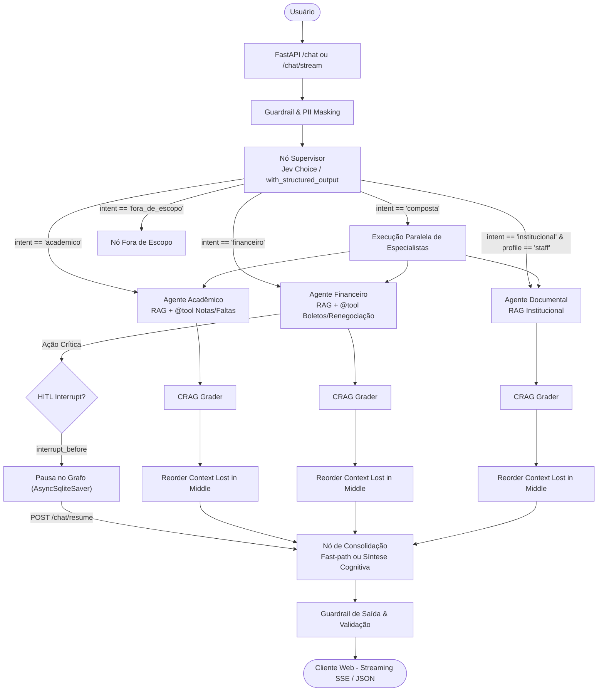

# 🧠 GEMINI.md — UsiEdu: Diretrizes Canônicas de Engenharia de IA & Governança (Tier 2)

> **Fonte Normativa Canônica Local (Harness Antigravity v1.5.2)**  
> Este arquivo define a arquitetura, as convenções de código, os papéis do sistema e os guardrails invioláveis aplicados em todo o ecossistema **UsiEdu**.

---

## 1. Stack & Padrões Normativos do Backend (Python)
* **Gerenciador & Ambiente:** Uso obrigatório de **`uv`** com **`pyproject.toml`** (padrão oficial PEP 621) e lockfile determinístico (`uv.lock`). Proibido `setup.py` ou `requirements.txt` solto.
* **Framework Web & Lifespan:** **FastAPI** assíncrono. Clientes de LLM, pools de embeddings e instâncias de grafos devem ser inicializados e finalizados estritamente via **`@asynccontextmanager lifespan`**. Proibido usar eventos legados `@app.on_event`.
* **Structured Outputs & Schema Enforcement:** Proibido extrair dados via regex frágil ou parsing manual de strings de LLM. Usar **Pydantic v2** com **`Instructor`** ou APIs nativas de *Structured Outputs* (`google-genai` com `response_schema`, OpenAI strict schemas), garantindo validação fail-fast e retries semânticos automáticos em caso de erro de schema.
* **Armazenamento Vetorial Serverless & OLAP Local (Zero-Daemon):**
  * **`LanceDB`**: Padrão ouro para armazenamento e busca vetorial serverless disk-based (zero containers pesados ociosos, queries híbridas vetor + texto full-text via Tantivy, multimodal e sem custo de infra).
  * **`DuckDB`**: Para consultas analíticas ultrarrápidas sobre logs de prompts, embeddings e telemetria particionada em **`.parquet`**.
* **Documentação de API:** **Scalar obrigatório** servido em `/docs` ou `/api/docs`. Proibido Swagger UI clássico.
* **Logging Estruturado:** **`structlog`** (formato JSON) injetando obrigatoriamente `trace_id`, `session_id`, `model_name` e `prompt_tokens` em todas as interações.

---

## 2. Arquitetura Multi-Agentes, RAG Avançado & MCP

### 2.1 Topologia Canônica do Grafo UsiEdu (LangGraph)

### 2.2 Decision Models & Roteamento Especializado (Jev First)
* Para nós de triagem, arestas condicionais de grafos (`conditional_edges`), guardrails de pré-execução e classificações onde não há geração de texto livre para o usuário, **avaliar obrigatoriamente o uso do Jev (`typesafe/jev-latest` via OpenRouter)**.
* Por ser um modelo "System One" nativo com formatos tipados (`Noul`, `Choice`, `Score`), latência sub-50ms e custo de output \$0.00, ele deve ser priorizado sobre LLMs de chat generalistas sempre que o objetivo for puramente decidir um caminho ou validar uma condição.

### 2.3 Persistência de Sessão & Time-Travel (Zero-Daemon)
* Uso obrigatório do **`AsyncSqliteSaver`** (SQLite local em arquivo) para checkpointer do LangGraph. Permite histórico de conversação, pausa/retomada de fluxos e *Human-in-the-Loop* (HITL) sem necessidade de servidores externos em desenvolvimento.

### 2.4 Governança de Memória Longa & LGPD
* **Working Memory:** Estado efêmero do grafo (`StateGraph` TypedDict/Pydantic) para a execução do ciclo atual.
* **Short-Term Memory:** Histórico de conversação multiturndo gerenciado pelo checkpointer `AsyncSqliteSaver`.
* **Long-Term Memory (Episodic & Semantic):**
  * *Local/Prototipagem*: **LanceDB** para armazenamento e busca de memórias episódicas e resumos via embeddings sem custo de infra.
  * *Corporativo/Multi-Tenant*: **PostgreSQL com `pgvector`** e políticas de isolamento Row-Level Security (RLS).
  * *Resumo Hierárquico*: Compressão periódica de mensagens antigas em resumos consolidados para evitar estouro da janela de contexto.
* **Política de Retenção & Expurgo (LGPD / Direito ao Esquecimento):** Definição obrigatória de TTL (Time-To-Live) em memórias de usuários e endpoint/função de expurgo determinístico de dados por `user_id`.

### 2.5 RAG Avançado, GraphRAG & Multimodal
* **Chunking Estratégico:** Divisão semântica ou contextual preservando cabeçalhos e metadados de origem (`source`, `page`, `chunk_id`).
* **Recuperação Híbrida:** Combinação de busca densa vetorial (embeddings) com busca esparsa lexical (BM25 ou Tantivy/LanceDB FTS).
* **Re-ranking Obrigatório:** Re-classificação do Top-K recuperado via Cross-Encoder (`bge-reranker-v2-m3` ou ONNX Runtime) antes de injetar no prompt final, eliminando ruído e reduzindo consumo de tokens.
* **Padrão CRAG / Self-RAG:** Avaliar a relevância dos documentos recuperados antes da síntese final (preferencialmente usando o Jev em modo `Score` ou `Noul` para latência mínima) antes de acionar fallback.
* **GraphRAG vs. RAG Híbrido:** RAG Híbrido para buscas pontuais/locais. **GraphRAG** para síntese temática global e consultas relacionais multi-entidade (detecção de comunidades Leiden). Stack: **Nano-GraphRAG / NetworkX** para serverless ($0/mês) ou **Neo4j Cypher** para enterprise.
* **RAG Multimodal (Vision-First):** Para PDFs com tabelas/gráficos complexos, extração contextual via modelos visuais (**ColPali** ou **Gemini Flash multimodal**), serializando tabelas em Markdown antes do chunking.
* **Model Context Protocol (MCP):** Para ferramentas corporativas, isolamento de integrações ou conexão com serviços externos, implementar servidores e clientes aderentes à especificação **MCP** cobrindo a tríade canônica: **Tools**, **Resources** e **Prompts**.

---

## 3. FinOps, AI Gateway & Observabilidade (LLMOps)
* **AI Gateway & Semantic Caching:** Centralizar chamadas de modelos em gateways compatíveis com OpenAI API (**LiteLLM Proxy** ou **Portkey**), habilitando *Semantic Caching* (meta de hit-rate > 30%) para reaproveitar respostas idênticas ou semanticamente equivalentes.
* **Fallback de Modelos & Resiliência:** Configurar hierarquia de fallback automático (ex.: `gemini-3.8-flash` padrão; fallback para modelos `:free` do OpenRouter consultando dinamicamente [https://openrouter.ai/collections/free-models](https://openrouter.ai/collections/free-models); fallback para `deepseek-v4-pro` para falhas ou tarefas complexas de raciocínio).
* **APM Central de LLMs & Prompt CMS (Langfuse):**
  * Instrumentar chamadas de agentes e grafos via **Langfuse SDK** ou OpenTelemetry, rastreando spans de nós, latência e custos por tenant.
  * **Versionamento de Prompts (Prompt CMS):** Prompts de produção gerenciados no Langfuse vinculados obrigatoriamente ao hash de commit do Git (`git rev-parse --short HEAD`) para rastreabilidade e rollback determinístico.
* **Diagnóstico de Embeddings (Arize Phoenix):** Utilizar exportação/análise via **Arize Phoenix** para visualização espacial (UMAP) de embeddings, identificando clusters de dúvidas de usuários não cobertos pela base de conhecimento.
* **APM de Infraestrutura (Datadog Pro & Sentry):**
  * Instrumentação com Datadog Pro (ativo via GitHub Student Pack) e Sentry para tracing distribuído e crash reporting.

---

## 4. Otimização de Prompts, Guardrails & Evals Contínuos
* **Compilação Algorítmica de Prompts:** Substituir o ajuste manual de prompts por compilação determinística com **DSPy** (`dspy.Signature`, `dspy.Module`), otimizando instruções e few-shots com base em métricas reais através do **GEPA** (*Genetic-Pareto* com otimização reflexiva em linguagem natural sobre traços de erro) como padrão ouro para agentes e RAG.
* **Guardrails Ativos em Runtime:** Implementar camada de interceptação rápida (<30ms) com **NeMo Guardrails**, **Guardrails AI** ou **Jev** para sanitização de entrada e validação de saída.
* **Avaliação de RAG & Evals Multi-Turno:**
  * *Tríade RAG (Ragas)*: Context Precision, Context Recall, Faithfulness e Answer Relevancy.
  * *Evals Multi-Turno & HITL*: Testes automatizados de diálogos longos avaliando retenção de preferências do usuário através de múltiplos turnos e reversão de estado com `AsyncSqliteSaver`.
* **Red-Teaming Gate no CI/CD:** Antes de publicar qualquer versão do agente, executar suite de pentest automatizado via **Promptfoo** (`promptfoo eval`), garantindo conformidade contra jailbreak e extração de system prompt.

---

## 5. Qualidade de Software, Testes & Fechamento por Evidência
* **Mocks de LLM Determinísticos:** Testes de integração de fluxos e grafos devem usar mocks determinísticos (`FakeChatModel`, `pytest-mock` ou respostas gravadas), evitando chamadas pagas e flakiness em CI.
* **Commits & Configurações:** Conventional Commits (`feat:`, `fix:`, etc.), `.env.example` versionado e `.env` no `.gitignore`.
* **Docker de Produção:** Multi-stage build slim, usuário `non-root`, healthchecks prontos para Azure Container Apps com Scale-to-Zero.
* **Harness & Evidência de Entrega (Anti-Vibe-Coding):** O agente nunca finaliza uma tarefa sem comprovação determinística. É obrigatório executar e validar no terminal: `ruff check`, formatação e a suíte `pytest`, apresentando o log de sucesso real ao usuário.
