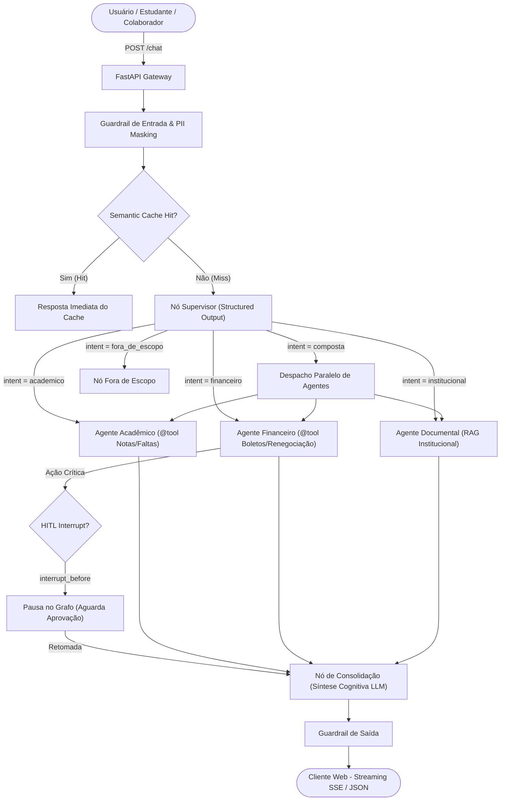

<div align="center">

# 🎓 UsiEdu — Enterprise Multi-Agent AI Platform

### Plataforma Multi-Agente Universitária com LangGraph, RAG Híbrido, Function Calling & Human-in-the-Loop

[](https://github.com/henriquebotelhogomes/UsiEdu/actions/workflows/quality_gate.yml)
[](https://www.python.org/)
[](https://github.com/langchain-ai/langgraph)
[](https://github.com/langchain-ai/langchain)
[](https://qdrant.tech/)
[-brightgreen?logo=pytest&logoColor=white)](https://github.com/henriquebotelhogomes/UsiEdu)
[-000000?logo=ruff&logoColor=white)](https://github.com/astral-sh/ruff)
[](https://azure.microsoft.com/)
[](LICENSE)

<br/>

[**🌐 Testar Aplicação Online**](https://usiedu-frontend.calmtree-d18b7257.brazilsouth.azurecontainerapps.io/) • [**📖 Documentação Técnica (MkDocs)**](https://henriquebotelhogomes.github.io/UsiEdu/) • [**📊 Relatório de Avaliação RAGAS**](src/evaluation/relatorio_ragas.md) • [**🧪 Agent Trajectory Harness**](src/harness/relatorio_harness.md)

</div>

---

## 📌 Sumário Executivo

O **UsiEdu** é uma plataforma conversacional multi-agente de padrão **Série B / Scale-up Enterprise**, desenhada para unificar o ecossistema de atendimento de instituições de ensino superior. 

Diferente de chatbots baseados em RAG simples (*single-prompt wrappers*), o UsiEdu opera sob um **Grafo de Estados Determinístico (LangGraph)**, combinando múltiplos agentes especialistas, execução nativa de ferramentas (*Function Calling*), aprovação humana no fluxo (*Human-in-the-Loop*), síntese cognitiva paralela e guardrails em camadas com controle de custos (*FinOps*).

---

## ⚡ Diferenciais Arquiteturais: RAG Tradicional vs. UsiEdu

| Dimensão | Chatbot / RAG Tradicional (MVP) | UsiEdu Enterprise Multi-Agent (Scale-up) |
|---|---|---|
| **Orquestração** | Cadeia linear única (sem estado granular) | **StateGraph (LangGraph)** com supervisor e checkpointer persistente |
| **Roteamento** | Parse frágil de strings / Regex | **`with_structured_output`** tipado com Pydantic v2 |
| **Execução de Ferramentas** | Funções manuais acopladas no prompt | **`@tool` nativo com `bind_tools`** e validação estrita de tipos |
| **Ações Sensíveis** | Execução automática sem confirmação | **Human-in-the-Loop (HITL)** via `interrupt_before` e `POST /chat/resume` |
| **Recuperação de Dados** | Busca vetorial densa isolada | **RAG Híbrido** (Qdrant denso + BM25 esparso + RRF + Re-ranker ONNX) |
| **FinOps & Tokens** | Histórico infinito com estouro de janela | **Semantic Cache (SQLite/Redis)** + **`trim_messages`** por janela de contexto |
| **Segurança & Compliance** | Sem tratamento de dados pessoais | **PII Masking (`mask_pii`)** + Guardrails anti-prompt injection multi-nível |
| **Qualidade & CI/CD** | Testes manuais / ad-hoc | **RAGAS Gate** + **Agent Trajectory Harness** bloqueando deploys em regressões |

---

## 🏛️ Topologia e Fluxo de Execução do Grafo Multi-Agente



---

## 🔬 Destaques Técnicos da Implementação

### 1. Roteamento Estruturado com Pydantic (`src/orchestration/supervisor.py`)
```python
# Elimina fragilidades de parsing de JSON cru com Structured Output nativo
decision = await router_model.with_structured_output(SupervisorDecision).ainvoke(prompt)
```

### 2. Function Calling e Binding Nativo (`src/tools/` & `src/agents/`)
```python
@tool
def get_notas(aluno_id: str) -> dict:
    """Consulta o histórico de notas e médias semestrais do estudante."""
    return db.query_grades(aluno_id)


agent_model = model.bind_tools([get_notas, get_faltas])
```

### 3. Human-in-the-Loop Interrupts (`src/orchestration/graph.py`)
```python
# Pausa a execução do grafo antes de executar nós críticos
graph = builder.compile(
    checkpointer=checkpointer,
    interrupt_before=["financeiro_confirmacao", "consolidation"],
)
```

### 4. RAG Híbrido com RRF e Cross-Encoder Re-ranker (`src/rag/`)
- **Qdrant Vector DB:** Busca semântica densa local com FastEmbed ONNX (`all-MiniLM-L6-v2`).
- **BM25 Lexical Search:** Indexação esparsa para palavras-chave e termos regulatórios.
- **Reciprocal Rank Fusion (RRF):** Fusão balanceada dos rankings esparso e denso.
- **Cross-Encoder Re-ranking:** Reclassificação com `BAAI/bge-reranker-base` para máxima precisão.

---

## 🧰 Stack Tecnológica Completa

| Camada | Tecnologias Utilizadas |
|---|---|
| **Orquestração Multi-Agente** | **LangGraph v0.2+**, **LangChain v0.3+**, `StateGraph`, `MemorySaver`, Checkpointers SQLite/PostgreSQL |
| **Recuperação & RAG** | **Qdrant**, BM25, Reciprocal Rank Fusion (RRF), Cross-Encoder Re-ranker (`bge-reranker-base`) |
| **Backend & APIs** | **FastAPI**, Python 3.12+, Server-Sent Events (SSE via `astream_events`), Pydantic v2, SlowAPI |
| **Modelos de Linguagem (LLMs)** | OpenCode Go (**DeepSeek V4 Flash**, **Kimi K2.7 Code**) + `FakeChatModel` para testes |
| **Segurança & FinOps** | Semantic Cache (SQLite/Redis), PII Masking (`mask_pii`), Guardrails Anti-Injection, `trim_messages` |
| **Avaliação & Harness** | **Agent Trajectory Harness**, Framework **RAGAS** (LLM-as-a-Judge), **LangSmith Tracing** |
| **Frontend & UI/UX** | **React 18**, **Vite**, **TypeScript**, Rich Markdown com botão de cópia de código, Vitest |
| **Infraestrutura em Nuvem** | **Azure Container Apps**, **Bicep (IaC)**, Azure Files, GitHub Container Registry (GHCR) |

---

## 📋 Contratos da API REST

| Método | Rota | Autenticação | Descrição |
|---|---|:---:|---|
| `POST` | `/auth/login` | Não | Autentica usuário e emite token JWT com RBAC (`student` ou `staff`) |
| `POST` | `/chat` | Sim | Envio síncrono com execução do grafo de agentes e retorno JSON estruturado |
| `POST` | `/chat/stream` | Sim | Streaming SSE token a token em tempo real (`astream_events(v2)`) |
| `POST` | `/chat/resume` | Sim | Retoma execução de uma thread pausada por Human-in-the-Loop (HITL) |
| `GET` | `/chat/history` | Sim | Recupera o histórico de mensagens persistido no checkpointer da sessão |
| `POST` | `/feedback` | Sim | Registra feedback 👍/👎 com comentário vinculado ao `run_id` no LangSmith |
| `GET` | `/feedback/stats` | Sim | Retorna métricas de satisfação agregadas |
| `GET` | `/health` | Não | Liveness e readiness check com estatísticas de cache e banco |

---

## 🚀 Guia de Instalação e Execução Local

### 1. Pré-requisitos
- **Python 3.12+**
- **Node.js 20+**
- **Docker Desktop** (em execução para o Qdrant)

### 2. Configuração do Backend

```powershell
# 1. Clone o repositório
git clone https://github.com/henriquebotelhogomes/UsiEdu.git
cd UsiEdu

# 2. Ative o ambiente virtual
.venv\Scripts\Activate.ps1    # Windows PowerShell
source .venv/bin/activate     # Linux / macOS

# 3. Instale as dependências
pip install -e ".[dev]"

# 4. Configure o arquivo .env
cp .env.example .env

# 5. Suba o Vector Database (Qdrant)
docker compose up -d qdrant

# 6. Ingestão dos documentos no Qdrant
python -m src.rag.ingest

# 7. Inicie o servidor FastAPI
uvicorn src.api.main:app --reload --host 0.0.0.0 --port 8000
```
- **API Swagger / OpenAPI:** [http://localhost:8000/docs](http://localhost:8000/docs)

### 3. Configuração do Frontend

Em outro terminal:
```powershell
cd frontend
npm install
npm run dev
```
- **Acesse a interface web:** [http://localhost:5173](http://localhost:5173)

### 🔑 Credenciais para Demonstração Local:

| Perfil | E-mail | Senha | Acesso / Permissões |
|---|---|---|---|
| **Estudante** | `ana@demo.usiedu` | `estudante123` | Agentes Acadêmico e Financeiro (Notas, Faltas, Boletos) |
| **Servidor / Staff** | `carlos@demo.usiedu` | `staff123` | Agentes Acadêmico, Financeiro e Documental/Institucional |

---

## 🧪 Qualidade Contínua e Quality Gates (CI/CD)

O repositório possui uma pipeline automatizada no GitHub Actions ([.github/workflows/quality_gate.yml](.github/workflows/quality_gate.yml)) executando 4 Quality Gates obrigatórios antes de qualquer deploy:

```bash
# 1. Verificação de Linter e Estilo (Ruff)
ruff check src/ tests/ scripts/

# 2. Suíte de Testes Unitários Automatizados (319 testes - 100% aprovados)
pytest tests/unit/

# 3. Quality Gate de Qualidade RAG (RAGAS LLM-as-a-Judge)
python scripts/run_ragas.py --ci-gate --min-score 0.80

# 4. Agent Loop & Trajectory Evaluation Gate (Agent Harness)
python scripts/run_harness.py --suite all --ci-gate --min-pass-rate 0.90
```

---

## 👤 Autor & Contato

**Henrique Botelho Gomes**  
Engenheiro de IA & Especialista em Sistemas Multi-Agente  

- 💼 **LinkedIn:** [linkedin.com/in/henriquebotelhogomes](https://www.linkedin.com/in/henriquebotelhogomes/)  
- 🐙 **GitHub:** [github.com/henriquebotelhogomes](https://github.com/henriquebotelhogomes)  
- 📚 **Documentação Completa (MkDocs):** [henriquebotelhogomes.github.io/UsiEdu](https://henriquebotelhogomes.github.io/UsiEdu/)  

---

## 📄 Licença

Distribuído sob a licença **MIT**. Consulte [LICENSE](LICENSE) para mais detalhes.
