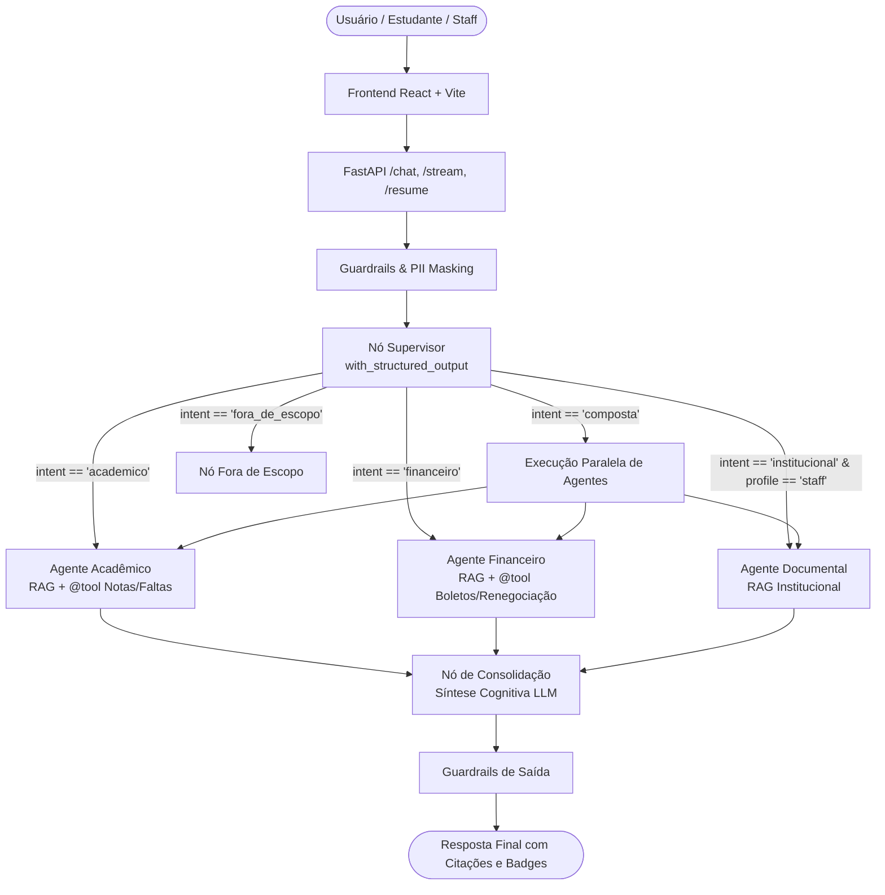

# UsiEdu — Plataforma Multi-Agente de IA Universitária

> Plataforma multi-agente de IA conversacional para a jornada acadêmica e administrativa de estudantes e colaboradores universitários.
> 
> **Padrão Enterprise / Startup Global (Série B / Scale-up)**

[](https://github.com/henriquebotelhogomes/UsiEdu/actions/workflows/quality_gate.yml)
[](https://www.python.org/)
[](https://github.com/langchain-ai/langgraph)
[](https://github.com/langchain-ai/langchain)
[](https://github.com/henriquebotelhogomes/UsiEdu)
[](LICENSE)

---

## 🌟 Visão Geral & Diferenciais

O **UsiEdu** resolve o atendimento universitário complexo unindo estudantes e servidores em um ecossistema multi-agente orquestrado por **LangGraph**, com **RAG Híbrido**, **Function Calling Nativo**, **Human-in-the-Loop**, **FinOps** e **Agent Trajectory Harness**:

- 🧠 **Orquestração Multi-Agente (LangGraph)**: Nó Supervisor com saídas tipadas via `with_structured_output(SupervisorDecision)`, roteamento resiliente para especialistas (*Acadêmico*, *Financeiro*, *Documental*) e consolidação cognitiva via LLM para consultas compostas multitemáticas.
- 🛠️ **Chamada Nativa de Ferramentas (`@tool` & `bind_tools`)**: Agentes munidos de ferramentas LangChain fortemente tipadas com execução assíncrona orientada pelo modelo (consultas de notas, faltas, boletos e renegociações).
- 🛡️ **Human-in-the-Loop (HITL)**: Interrupção controlada de nós sensíveis (`interrupt_before`) no StateGraph com suspensão e retomada segura via `POST /chat/resume`.
- 🔍 **RAG Híbrido com Re-ranker Local**: Combinação de busca vetorial densa (Qdrant + FastEmbed ONNX) com busca léxica esparsa (BM25) via *Reciprocal Rank Fusion* (RRF) e reordenação com Cross-Encoder (`bge-reranker-base`), sem custo de APIs proprietárias para embeddings.
- 🔒 **FinOps & Segurança em Camadas**:
  - **Cache Semântico Plugável**: SQLite para desenvolvimento local e Redis para produção (similaridade de cosseno com threshold configurável).
  - **Poda de Contexto Inteligente (`trim_messages`)**: Controle de janela para evitar desperdício de tokens.
  - **Sanitização de PII (`mask_pii`)**: Ofuscação de CPFs, cartões e dados sensíveis antes do envio aos agentes e logs.
  - **Guardrails Multi-Camada**: Interceptação em tempo real de jailbreaks, XSS e prompt injection.
- 🧪 **Agent Trajectory & Evaluation Harness**: Motor de avaliação de loop e validação de trajetórias (`scripts/run_harness.py` e `scripts/run_ragas.py`), inspirado em *better-harness* e *deepseek-harness*, integrado ao CI/CD.
- ⚡ **Streaming em Tempo Real**: Endpoint SSE (`POST /chat/stream`) com eventos tipados via `astream_events(v2)`.
- 💻 **Frontend Rico em React + TypeScript**: Renderização de Markdown rica com blocos de código copiáveis em 1 clique, tabelas estilizadas e gaveta de fontes citadas.
- ☁️ **Infraestrutura em Nuvem (Azure)**: Azure Container Apps, Bicep IaC, GHCR e persistência de checkpoints e cache.

---

## 🏗️ Arquitetura do Sistema



---

## 💻 Demonstração e Acesso

- 🌐 **Aplicação em Produção (Azure):** [https://usiedu-frontend.calmtree-d18b7257.brazilsouth.azurecontainerapps.io/](https://usiedu-frontend.calmtree-d18b7257.brazilsouth.azurecontainerapps.io/)
- 🔑 **Credenciais Demo:** `ana@demo.usiedu` / `estudante123` *(visíveis na tela de login)*
- 📖 **Documentação Técnica (MkDocs):** [https://henriquebotelhogomes.github.io/UsiEdu/](https://henriquebotelhogomes.github.io/UsiEdu/)

---

## 🧰 Stack Tecnológica

| Camada | Tecnologias |
|---|---|
| **Orquestração Multi-Agente** | LangGraph, LangChain, MemorySaver, SQLite/PostgreSQL Checkpointers |
| **Recuperação & RAG** | Qdrant, BM25, Reciprocal Rank Fusion (RRF), Cross-Encoder Re-ranker (bge-reranker-base) |
| **Backend & Streaming** | FastAPI, Python 3.12+, Server-Sent Events (SSE), Pydantic v2, SlowAPI |
| **Modelos (LLMs)** | OpenCode Go (DeepSeek V4 Flash, Kimi K2.7 Code) e FakeChatModel para testes |
| **Segurança & FinOps** | Semantic Cache (SQLite/Redis), PII Masking, Multi-layer Guardrails, `trim_messages` |
| **Avaliação & Harness** | Agent Trajectory Harness, RAGAS (LLM-as-a-Judge), LangSmith Tracing |
| **Frontend** | React 18, Vite, TypeScript, Rich Markdown, Vitest |
| **Infraestrutura & CI/CD** | Azure Container Apps, Bicep IaC, Docker, GitHub Actions, Scale-to-Zero |

---

## 📋 Endpoints da API REST

| Método | Rota | Autenticação | Descrição |
|---|---|:---:|---|
| `POST` | `/auth/login` | Não | Autentica usuário e emite JWT com RBAC (`student` / `staff`) |
| `POST` | `/chat` | Sim | Processa consulta no grafo com resposta JSON estruturada |
| `POST` | `/chat/stream` | Sim | Streaming SSE token a token em tempo real (`astream_events`) |
| `POST` | `/chat/resume` | Sim | Retoma thread pausada por Human-in-the-Loop (aprovação humana) |
| `GET` | `/chat/history` | Sim | Retorna histórico de mensagens persistidas da thread |
| `POST` | `/feedback` | Sim | Registra feedback 👍/👎 vinculado ao `run_id` no LangSmith |
| `GET` | `/feedback/stats` | Sim | Retorna métricas de satisfação e taxa de aprovação |
| `GET` | `/health` | Não | Liveness e readiness check com estatísticas de cache |

---

## 🚀 Quickstart & Desenvolvimento Local

### 1. Pré-requisitos
- Python 3.12+
- Node.js 20+
- Docker e Docker Compose

### 2. Instalação e Configuração

```bash
# 1. Clonar o repositório
git clone https://github.com/henriquebotelhogomes/UsiEdu.git
cd UsiEdu

# 2. Criar e ativar o ambiente virtual
python -m venv .venv
source .venv/bin/activate        # Linux / macOS
.venv\Scripts\activate           # Windows

# 3. Instalar dependências em modo de desenvolvimento
pip install -e ".[dev]"

# 4. Configurar variáveis de ambiente
cp .env.example .env

# 5. Subir o Vector Database (Qdrant)
docker compose up -d qdrant

# 6. Ingerir documentos na base de conhecimento
python -m src.rag.ingest
```

### 3. Comandos Essenciais

```bash
# Executar a suíte completa de testes unitários (319 testes)
pytest tests/unit/

# Executar verificação de estilo e lint
ruff check src/ tests/ scripts/

# Executar o Agent Trajectory Harness (CI Quality Gate)
python scripts/run_harness.py --suite all --ci-gate

# Executar a avaliação RAGAS (LLM-as-a-Judge)
python scripts/run_ragas.py --ci-gate --min-score 0.80

# Iniciar ambiente integrado local (API + Frontend)
powershell -ExecutionPolicy Bypass -File scripts/dev.ps1   # Windows
make dev                                                  # Linux / macOS
```

---

## 🧪 Qualidade, CI/CD e Governança

O repositório possui uma pipeline automatizada no GitHub Actions ([.github/workflows/quality_gate.yml](.github/workflows/quality_gate.yml)) executando 4 barreiras obrigatórias:
1. **Linter & Style:** `ruff check src/ tests/ scripts/` (0 erros permitidos).
2. **Testes Unitários:** `pytest tests/unit/` (>315 testes automatizados com cobertura).
3. **RAG Quality Gate:** `python scripts/run_ragas.py --ci-gate --min-score 0.80` (avaliação de fidelidade e relevância).
4. **Multi-Agent Trajectory Gate:** `python scripts/run_harness.py --suite all --ci-gate --min-pass-rate 0.90` (validação de intenções, ferramentas `@tool` chamadas e guardrails).

---

## 👤 Autor

**Henrique Botelho Gomes**  
Engenheiro de IA & Especialista em Sistemas Multi-Agente  
- [LinkedIn](https://www.linkedin.com/in/henriquebotelhogomes/)
- [GitHub](https://github.com/henriquebotelhogomes)
- [Documentação Oficial](https://henriquebotelhogomes.github.io/UsiEdu/)

---

## 📄 Licença

Este projeto está sob a licença [MIT](LICENSE).
