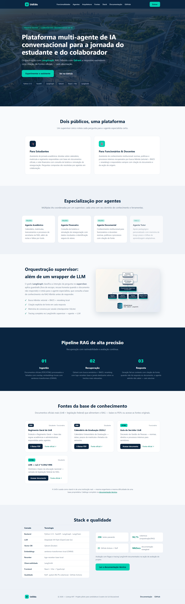
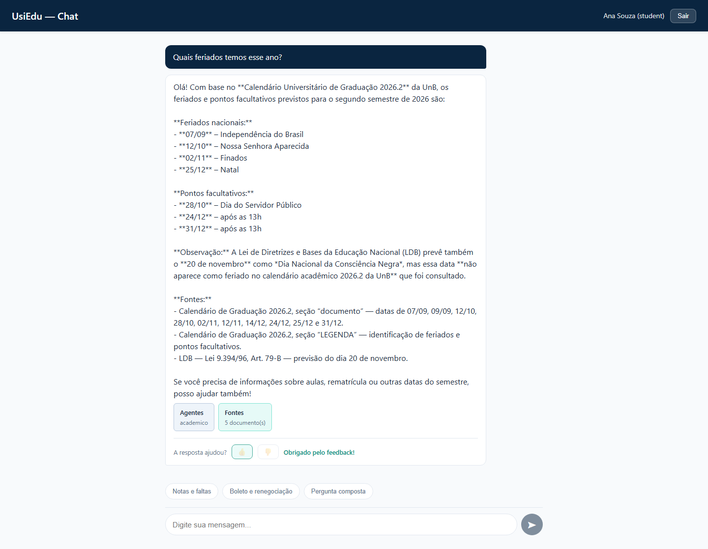
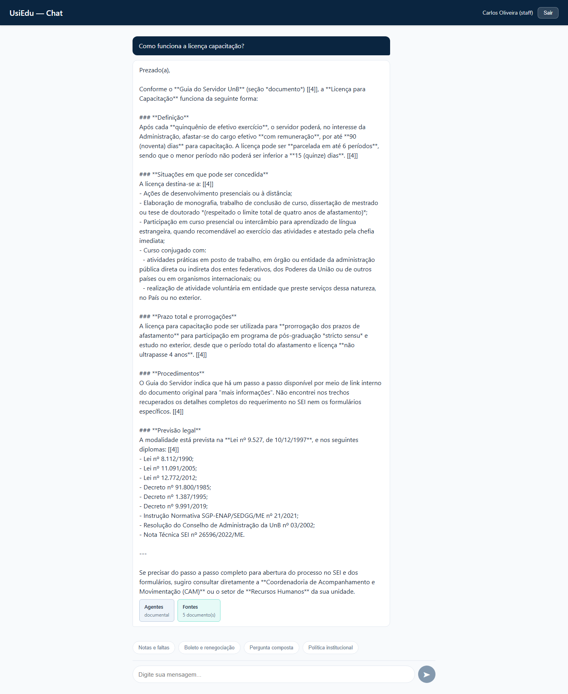
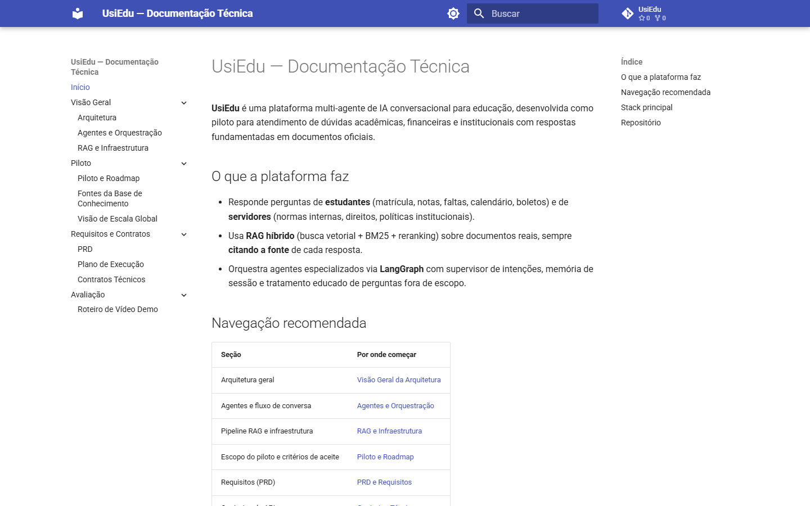

# UsiEdu

> Plataforma multi-agente de IA conversacional para a jornada do estudante e do colaborador.
>
> **Projeto piloto**

[](https://github.com/henriquebotelhogomes/UsiEdu/actions/workflows/ci.yml)
[](https://www.python.org/)
[](LICENSE)

## Pitch

Um assistente de IA conversacional que atende estudantes e colaboradores em
uma única plataforma: dúvidas acadêmicas, financeiras e de processos internos
resolvidas por agentes especializados, orquestrados por um supervisor em
LangGraph, com respostas sempre citando as fontes da base de conhecimento.

Construído como projeto piloto de ponta a ponta — do RAG com reranker local à
observabilidade com LangSmith, do guardrails contra prompt injection ao deploy
em Azure com CI/CD — este repositório é uma demonstração prática de engenharia
de IA em produção, não apenas de um protótipo de notebook.

## Diferenciais

- **Orquestração multi-agente (LangGraph)**: supervisor que roteia para agentes
  especializados (Acadêmico, Financeiro, Documental) e coordena fluxos A2A.
- **RAG com reranker local**: Qdrant + FastEmbed ONNX + bge-reranker-base,
  rodando sem custo de API de embedding.
- **Segurança em camadas**: guardrails anti-prompt injection em 3 níveis,
  autenticação JWT por perfil (estudante/colaborador) e rate limiting.
- **Human-on-the-loop**: feedback 👍/👎 persistido, anexado ao trace no
  LangSmith e agregado em uma página de satisfação (`/insights`).
- **Engenharia de qualidade**: cache semântico de respostas, avaliação Ragas,
  testes automatizados, lint e CI/CD no GitHub Actions.
- **Deploy real em Azure**: IaC com Bicep e Container Apps, escalando a zero.

## Demonstração

▶ **Teste ao vivo:** https://usiedu-frontend.calmtree-d18b7257.brazilsouth.azurecontainerapps.io/

Credenciais demo: `ana@demo.usiedu` / `estudante123` (visíveis na tela de login).

> O ambiente escala a zero para economizar crédito; a primeira abertura ou
> resposta pode levar até 60 segundos (cold start).

## Sobre o autor

Projeto desenvolvido por **Henrique Botelho Gomes** como piloto de candidatura
para Engenheiro(a) de IA. O repositório reúne o ciclo completo de um produto de
IA: levantamento de requisitos e PRD, arquitetura e decisões técnicas,
implementação, avaliação, documentação e deploy.

- [LinkedIn](https://www.linkedin.com/in/henriquebotelhogomes/)
- [GitHub](https://github.com/henriquebotelhogomes)
- [Documentação técnica (MkDocs)](https://henriquebotelhogomes.github.io/UsiEdu/)

**Disponível para entrevistas — vamos agendar uma conversa!** 👋

## Screenshots

**Landing page** — apresentação institucional com funcionalidades, agentes, arquitetura, fontes e stack:



**Chat como estudante** — pergunta sobre feriados respondida com citação das fontes (Agente Acadêmico):



**Chat como funcionário** — licença capacitação respondida pelo Agente Documental com base no Guia do Servidor:



**Documentação técnica** — MkDocs Material publicada no GitHub Pages:



Para regenerar os prints com o sistema rodando localmente: `python scripts/capture_screenshots.py`
(requer `pip install playwright && python -m playwright install chromium`).

## Funcionalidades

- **Estudantes**: assistente de jornada acadêmica — dúvidas acadêmicas e
  financeiras resolvidas por agentes colaboradores.
- **Funcionários/Docentes**: assistente de conhecimento institucional — normas,
  políticas e processos internos com citação de fonte.
- **Chat com fontes citadas** e indicação do agente que respondeu.
- **Feedback 👍/👎** em cada resposta, com taxa de satisfação em `/insights`.

## Arquitetura

```
┌──────────────────────────────────────┐
│       Frontend (React + Vite)        │
└──────────────┬───────────────────────┘
               │ REST/WebSocket
┌──────────────▼───────────────────────┐
│        API Gateway (FastAPI)         │
└──────────────┬───────────────────────┘
               │
┌──────────────▼───────────────────────┐
│   Orquestrador Supervisor (LangGraph)│
└──┬───────┬───────┬───────┬──────────┘
   │       │       │       │
 Acadê- Finan-  Tutor  Documental/
  mico   ceiro  (F2)  Processos (F2)
               │
┌──────────────▼───────────────────────┐
│   Infraestrutura Compartilhada       │
│   RAG · Qdrant · LangSmith · MCP    │
└──────────────────────────────────────┘
```

**Decisões técnicas (por quê):**

- **FastAPI + LangGraph**: API assíncrona com tipagem forte, e um grafo
  explícito para orquestração multi-agente — roteamento, estado e fluxos A2A
  viram código versionável e testável, não "prompt magic".
- **Embeddings e reranker locais (ONNX)**: qualidade de RAG sem custo por
  chamada de API de embedding — decisão crítica para escala e economia.
- **Qdrant**: vector DB dedicado com filtros e alta disponibilidade, em vez de
  embutir a busca na aplicação.

Detalhes completos na documentação (`docs/`).

## Stack

| Camada | Tecnologia |
|---|---|
| Backend | Python 3.12+, FastAPI, LangGraph, LangChain |
| LLM | OpenCode Go (DeepSeek V4 Flash + Kimi K2.7 Code) |
| Vector DB | Qdrant (Docker) |
| Embeddings | FastEmbed / sentence-transformers (local, ONNX) |
| Reranker | bge-reranker-base (local) |
| Observabilidade | LangSmith |
| Frontend | React + Vite + TypeScript + react-router-dom |
| Qualidade | Ruff, pytest, GitHub Actions |
| Documentação | MkDocs Material |

## Qualidade e avaliação

- **CI no GitHub Actions**: lint (Ruff), formatação e testes a cada push/PR.
- **Testes**: suíte pytest no backend e Vitest/Testing Library no frontend.
- **Avaliação Ragas** (`src/evaluation/relatorio_ragas.md`): pipeline de
  avaliação RAGAS+LLM com 26+ perguntas e leitura crítica honesta dos
  resultados:

| Métrica | Meta | Resultado | Leitura |
|---|---|---|---|
| faithfulness | ≥ 0.9 | 0.565 | Gap real de corpus: o Guia do Servidor indexado não cobre temas como Lei 8.112/90 — agente respondeu honestamente "não encontrei" |
| context_precision | ≥ 0.8 | 0.645 | Penalizado por perguntas fora de escopo (redirecionamento correto previsto no RF-10) |
| context_recall | ≥ 0.8 | 0.645 | Mesma causa: lacuna de base de conhecimento, não de pipeline |
| answer_relevancy | ≥ 0.85 | 0.565 | Melhorado na prática excluindo perguntas fora de escopo (~0,65) |

O relatório identifica a causa-raiz e o plano de melhoria em
`docs/04-piloto-e-roadmap.md` — transparência sobre limitações e o caminho de
evolução fazem parte do processo de engenharia.

## Quickstart

### Pré-requisitos

- Python 3.12+
- Node.js 20+
- Docker e Docker Compose

### Instalação

```bash
# 1. Clone o repositório
git clone https://github.com/henriquebotelhogomes/UsiEdu.git
cd UsiEdu

# 2. Crie o ambiente virtual
python -m venv .venv
source .venv/bin/activate        # Linux/macOS
.venv\Scripts\activate           # Windows

# 3. Instale as dependências
pip install -e .

# 4. Configure as variáveis de ambiente
cp .env.example .env
# Edite .env com suas chaves (OPENCODE_GO_API_KEY, LANGSMITH_API_KEY, JWT_SECRET)

# 5. Suba o Qdrant
docker compose up -d qdrant
```

### Desenvolvimento

```bash
# Subir todos os serviços (Qdrant + API + frontend)
powershell -File scripts/dev.ps1        # Windows
make dev                                # Linux/macOS

# Rodar testes
pytest

# Lint e formatação
ruff check .
ruff format .

# Ingerir documentos na base de conhecimento
python -m src.rag.ingest

# Rodar a API
uvicorn src.api.main:app --reload
```

## API

| Método | Rota | Auth | Descrição |
|---|---|---|---|
| POST | `/auth/login` | não | Autentica e retorna JWT |
| POST | `/chat` | sim | Envia mensagem, recebe resposta com fontes e agentes envolvidos |
| POST | `/feedback` | sim | Registra avaliação 👍/👎 da resposta (human-on-the-loop) |
| GET | `/feedback/stats` | sim | Métricas agregadas de satisfação |
| GET | `/health` | não | Liveness check |

## Deploy — Azure Container Apps

O piloto está publicado em **Azure Container Apps** (brazilsouth), com IaC em
Bicep (`infra/azure/`): ACR, Container Apps, Azure Files e job de ingestão.
O script de deploy (`infra/azure/deploy.ps1`) cria os recursos, publica as
imagens e gera um `JWT_SECRET` novo a cada execução — segredos nunca são
gravados no repositório. O frontend é a única origem pública; API e Qdrant
permanecem na rede interna do ambiente.

## Documentação

A documentação completa está em `docs/`:

| Documento | Conteúdo |
|---|---|
| `01-visao-geral-arquitetura.md` | Visão, personas, arquitetura |
| `02-agentes-e-orquestracao.md` | Agentes, grafo LangGraph, fluxos A2A |
| `03-rag-e-infraestrutura.md` | Pipeline RAG, vector DB, MCP, memória |
| `04-piloto-e-roadmap.md` | Escopo, critérios de aceite, roadmap |
| `05-fontes-base-conhecimento.md` | Catálogo de fontes abertas (UnB) |
| `06-visao-escala-global.md` | Gap analysis para escala global |
| `07-prd-requisitos.md` | PRD: requisitos funcionais e não-funcionais |
| `08-plano-execucao.md` | Sprints, tarefas e Definition of Done |
| `09-contratos-tecnicos.md` | API, env vars, modelos de dados, convenções |

## Licença

MIT — ver [LICENSE](LICENSE).
