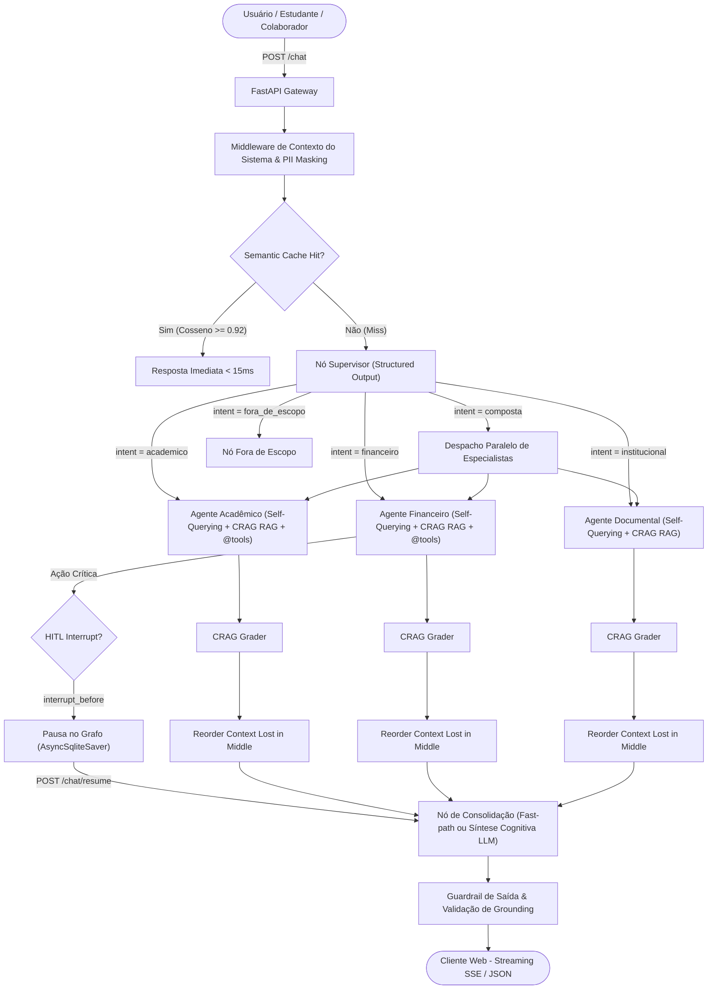

<div align="center">

# 🎓 UsiEdu — Enterprise Multi-Agent AI Platform

### Plataforma Multi-Agente Universitária com LangGraph, RAG Híbrido, Function Calling & Human-in-the-Loop

[](https://github.com/henriquebotelhogomes/UsiEdu/releases)
[](https://github.com/henriquebotelhogomes/UsiEdu/pkgs/container/usiedu-api)
[](https://github.com/henriquebotelhogomes/UsiEdu/actions/workflows/quality_gate.yml)
[](https://github.com/henriquebotelhogomes/UsiEdu/actions/workflows/codeql.yml)
[](https://www.python.org/)
[](https://github.com/langchain-ai/langgraph)
[](https://github.com/langchain-ai/langchain)
[-red?logo=qdrant&logoColor=white)](https://qdrant.tech/)
[-brightgreen?logo=pytest&logoColor=white)](https://github.com/henriquebotelhogomes/UsiEdu)
[-000000?logo=ruff&logoColor=white)](https://github.com/astral-sh/ruff)
[](https://azure.microsoft.com/)
[](LICENSE)

<br/>

[**🌐 Testar Aplicação Online**](https://usiedu-frontend.calmtree-d18b7257.brazilsouth.azurecontainerapps.io/) • [**📖 Documentação Técnica (MkDocs)**](https://henriquebotelhogomes.github.io/UsiEdu/) • [**📊 Relatório de Avaliação RAGAS**](src/evaluation/relatorio_ragas.md) • [**🧪 Agent Trajectory Harness**](src/harness/relatorio_harness.md)

</div>

---

## 📌 Sumário Executivo

O **UsiEdu** é uma plataforma conversacional multi-agente de padrão **Série B / Scale-up Enterprise**, desenhada para unificar o ecossistema de atendimento e autosserviço de instituições de ensino superior. 

Diferente de chatbots baseados em RAG simples (*single-prompt wrappers*), o UsiEdu opera sob um **Grafo de Estados Determinístico (LangGraph)**, combinando múltiplos agentes especialistas, execução nativa de ferramentas (*Function Calling*), aprovação humana no fluxo (*Human-in-the-Loop*), middleware de contexto universal, síntese cognitiva paralela, mitigação de *Lost in the Middle*, recuperação hierárquica e guardrails em camadas com controle de custos (*FinOps*).

---

## ⚡ Diferenciais Arquiteturais: RAG Tradicional vs. UsiEdu Enterprise

| Dimensão | Chatbot / RAG Tradicional (MVP) | UsiEdu Enterprise Multi-Agent (Scale-up) |
|---|---|---|
| **Orquestração** | Cadeia linear única (sem estado granular) | **StateGraph (LangGraph)** com supervisor tipado e checkpointer persistente (`AsyncSqliteSaver`) |
| **Contexto Temporal** | Dependência de funções ad-hoc / LLM sem relógio | **Middleware Universal de Contexto** (Data/Hora de Brasília, Timezone e Perfil) |
| **Recuperação de Chunks** | Fatiamento ingênuo por tamanho fixo | **Contextual Retrieval (Anthropic)** + **Hierarchical Parent-Document (`parent_text`)** |
| **Atenção do Modelo** | Injeção linear sujeita a *Lost in the Middle* | **Reordenação Balanceada (`reorder_context` `[1º, 3º, 5º, 4º, 2º]`)** |
| **Resolução de Perguntas** | Busca com pronomes do usuário ("ele", "disso") | **Query Rewriter & Resolução Coreferencial** antes de consultar índices |
| **Filtragem Pré-Busca** | Busca vetorial cega em toda a base | **Self-Querying Metadata Filtering** pré-HNSW (documentos e normas oficiais) |
| **Filtragem de Ruído** | Injeta os Top-K cegamente no prompt | **Corrective RAG (CRAG)** com Retrieval Grader (score $\ge 0.05$) |
| **Recuperação de Dados** | Busca vetorial densa isolada | **RAG Híbrido 4 Estágios** (Qdrant + BM25 + RRF + Cross-Encoder Re-ranker) |
| **FinOps & Cache** | Sem cache / reexecução cara | **Semantic Cache calibrated a 0.92** + **Warmup** (<15ms) + **`trim_messages`** |
| **Ações Sensíveis** | Execução automática sem confirmação | **Human-in-the-Loop (HITL)** via `interrupt_before` e `POST /chat/resume` |
| **Segurança & Compliance** | Sem tratamento de dados pessoais | **PII Masking (`mask_pii`)** + Guardrails anti-prompt injection multi-nível |
| **Avaliação & CI/CD** | Testes manuais / ad-hoc | **Dataset Sintético (50 casos)** + **RAGAS Quality Gate** + **Agent Harness** |

---

## 🏛️ Topologia e Fluxo de Execução do Grafo Multi-Agente



---

## 🔬 Destaques Técnicos da Implementação

### 1. Hierarchical Parent-Document & Contextual Retrieval (`src/rag/chunker.py`)
Combina contextualização hierárquica do documento pai com preservação de seções completas (`parent_text`), reduzindo falhas de recuperação em até 49% e entregando contexto rico ao modelo:
```text
Este trecho pertence ao documento 'Regimento Geral da UnB' da instituição 'UnB', seção 'Art. 15'.
[Texto fatiado para indexação sensível com referência ao parent_text expandido...]
```

### 2. Mitigação do Efeito "Lost in the Middle" (`src/rag/retriever.py`)
Reorganiza os chunks mais relevantes para as posições de maior atenção do LLM (`[1º, 3º, 5º, 4º, 2º]`), evitando a perda de contexto no centro de blocos longos de documentos.

### 3. Self-Querying & Filtragem Pré-HNSW (`src/rag/query_rewriter.py`)
Extrai metadados estruturados das perguntas (documento, instituição, normas) e aplica filtros booleanos no Qdrant antes do cálculo vetorial, acelerando a busca e eliminando ruídos.

### 4. Poda Dinâmica de Contexto & FinOps (`src/agents/`)
Adota `trim_messages` do LangChain (`max_tokens=2000`) em todas as invocações de agentes para garantir economia de tokens e proteção contra estouro de contexto.

### 5. Semantic Cache com Warmup Automatizado (`src/rag/cache.py` / `scripts/warmup_cache.py`)
Calibrado em limiar de cosseno **0.92**, respondendo a dúvidas frequentes com latência $< 15\text{ms}$ e custo zero de tokens.

### 6. Corrective RAG (CRAG) com Retrieval Grader (`src/rag/crag_grader.py`)
Após o re-ranking pelo Cross-Encoder, o `RetrievalGrader` descarta candidatos com relevância $< 0.05$ — limiar recalibrado por medição sobre o corpus real (ver nota T10.2 em `docs/08`). O grader atua como poda de candidatos claramente não relacionados; a recusa por ausência de dados é decidida pelo agente sobre o contexto restante, não pelo threshold.

### 7. Human-in-the-Loop com Persistência Assíncrona (`src/orchestration/graph.py`)
```python
# Pausa o grafo com checkpointer assíncrono persistente (AsyncSqliteSaver)
graph = builder.compile(
    checkpointer=checkpointer,
    interrupt_before=["financeiro_confirmacao", "trancar_matricula"],
)
```

---

## 🧰 Stack Tecnológica Completa

| Camada | Tecnologias Utilizadas |
|---|---|
| **Orquestração Multi-Agente** | **LangGraph v0.2+**, **LangChain v0.3+**, `StateGraph`, `MemorySaver`, Checkpointers SQLite/PostgreSQL |
| **Recuperação & RAG** | **Qdrant**, BM25, Contextual Retrieval (Anthropic), CRAG Grader, Cross-Encoder (`bge-reranker-v2-m3`) |
| **Backend & APIs** | **FastAPI**, Python 3.12+, Server-Sent Events (SSE via `astream_events`), Pydantic v2, SlowAPI |
| **Modelos de Linguagem (LLMs)** | OpenCode Go (**DeepSeek V4 Flash**, **Kimi K2.7 Code**) + `FakeChatModel` para testes |
| **Segurança & FinOps** | Semantic Cache (SQLite/Redis) + Warmup, PII Masking (`mask_pii`), Guardrails Anti-Injection, `trim_messages` |
| **Avaliação & Harness** | **Synthetic Testset Generator**, **RAGAS** (LLM-as-a-Judge), **Agent Trajectory Harness**, **LangSmith Tracing** |
| **Frontend & UI/UX** | **React 18**, **Vite**, **TypeScript**, Rich Markdown com botão de cópia de código, Vitest |
| **Infraestrutura em Nuvem** | **Azure Container Apps**, **Bicep (IaC)**, Azure Files, GitHub Container Registry (GHCR) |

---

## 📋 Contratos da API REST

| Método | Rota | Autenticação | Descrição |
|---|---|:---:|---|
| `GET` | `/` | Não | Boas-vindas e links diretos para Swagger (`/docs`) e status (`/health`) |
| `POST` | `/auth/login` | Não | Autentica usuário e emite token JWT com RBAC (`student` ou `staff`) |
| `POST` | `/chat` | Sim | Envio síncrono com execução do grafo de agentes e retorno JSON estruturado |
| `POST` | `/chat/stream` | Sim | Streaming SSE token a token em tempo real (`astream_events(v2)`) |
| `POST` | `/chat/resume` | Sim | Retoma execução de uma thread pausada por Human-in-the-Loop (HITL) |
| `GET` | `/chat/history` | Sim | Recupera o histórico de mensagens persistido no checkpointer da sessão |
| `POST` | `/feedback` | Sim | Registra feedback 👍/👎 com comentário vinculado ao `run_id` no LangSmith |
| `GET` | `/feedback/stats` | Sim | Retorna métricas de satisfação agregadas |
| `GET` | `/health` | Não | Liveness e readiness check com estatísticas de cache e banco |

---

## 🚀 Guia de Instalação e Execução Local

### 1. Pré-requisitos
- **Python 3.12+**
- **Node.js 20+**
- **Docker Desktop** (em execução para o Qdrant)

### 2. Configuração do Backend

```powershell
# 1. Clone o repositório
git clone https://github.com/henriquebotelhogomes/UsiEdu.git
cd UsiEdu

# 2. Ative o ambiente virtual
.venv\Scripts\Activate.ps1    # Windows PowerShell
source .venv/bin/activate     # Linux / macOS

# 3. Instale as dependências
pip install -e ".[dev]"

# 4. Configure o arquivo .env
cp .env.example .env

# 5. Suba o Vector Database (Qdrant)
docker compose up -d qdrant

# 6. Ingestão dos documentos no Qdrant (com Contextual Retrieval)
python -m src.rag.ingest

# 7. Pré-aquecimento do Semantic Cache (Warmup)
python scripts/warmup_cache.py

# 8. (Opcional) Gerar dataset sintético para avaliação Ragas
python scripts/generate_synthetic_testset.py --count 50

# 9. Inicie o servidor FastAPI
uvicorn src.api.main:app --reload --host 0.0.0.0 --port 8000
```
- **API Swagger / OpenAPI:** [http://localhost:8000/docs](http://localhost:8000/docs)

### 3. Configuração do Frontend

Em outro terminal:
```powershell
cd frontend
npm install
npm run dev
```
- **Acesse a interface web:** [http://localhost:5173](http://localhost:5173)

### 🔑 Credenciais para Demonstração Local:

| Perfil | E-mail | Senha | Acesso / Permissões |
|---|---|---|---|
| **Estudante** | `ana@demo.usiedu` | `estudante123` | Agentes Acadêmico e Financeiro (Notas, Faltas, Boletos) |
| **Servidor / Staff** | `carlos@demo.usiedu` | `staff123` | Agentes Acadêmico, Financeiro e Documental/Institucional |

---

## 🧪 Qualidade Contínua e Quality Gates (CI/CD)

O repositório possui uma pipeline automatizada no GitHub Actions ([.github/workflows/quality_gate.yml](.github/workflows/quality_gate.yml)) executando 4 Quality Gates obrigatórios antes de qualquer deploy:

```bash
# 1. Verificação de Linter e Estilo (Ruff)
ruff check src/ tests/ scripts/

# 2. Suíte de Testes Unitários Automatizados (538 testes - 100% aprovados)
pytest tests/unit/

# 3. Quality Gate de Qualidade RAG (RAGAS LLM-as-a-Judge)
python scripts/run_ragas.py --ci-gate --min-score 0.80

# 4. Agent Loop & Trajectory Evaluation Gate (Agent Harness)
python scripts/run_harness.py --suite all --ci-gate --min-pass-rate 0.90
```

---

## 👤 Autor & Contato

**Henrique Botelho Gomes**  
Engenheiro de IA & Especialista em Sistemas Multi-Agente  

- 💼 **LinkedIn:** [linkedin.com/in/henriquebotelhogomes](https://www.linkedin.com/in/henriquebotelhogomes/)  
- 🐙 **GitHub:** [github.com/henriquebotelhogomes](https://github.com/henriquebotelhogomes)  
- 📚 **Documentação Completa (MkDocs):** [henriquebotelhogomes.github.io/UsiEdu](https://henriquebotelhogomes.github.io/UsiEdu/)  

---

## 📄 Licença

Distribuído sob a licença **MIT**. Consulte [LICENSE](LICENSE) para mais detalhes.
