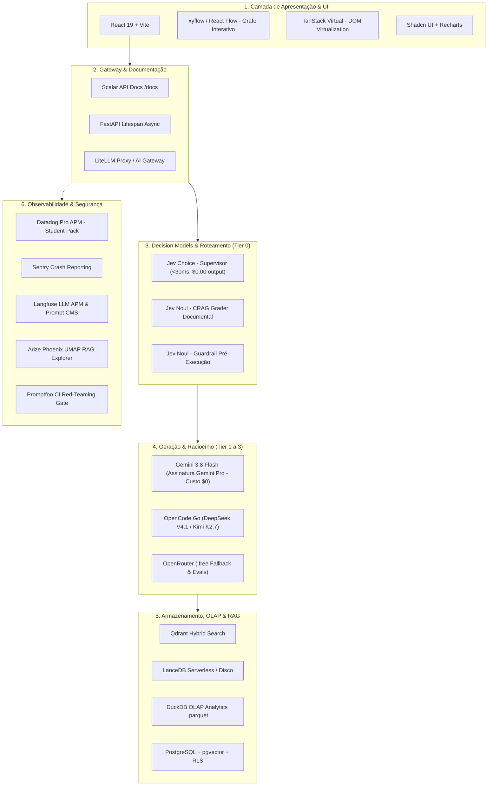
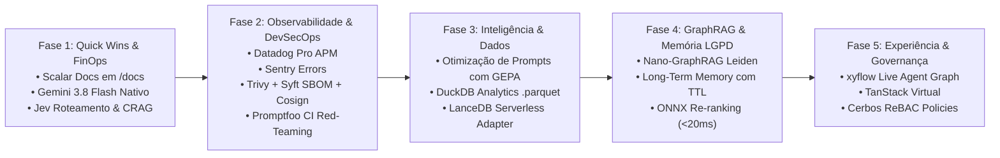

# 🚀 Plano Estratégico de Elevação Arquitetural — Padrão Enterprise Harness

> **Documento Normativo e Plano Diretor de Modernização.**  
> Alinhamento do ecossistema **UsiEdu** com as **Diretrizes Globais de Engenharia & Governança (Harness Antigravity)** e o **Inventário de Recursos de IA (resources.md)**.  
> **Status:** Proposto / Blueprint Arquitetural para Implementação Faseada.

---

## Executive Summary

O **UsiEdu** consolidou com sucesso uma arquitetura de referência multi-agente baseada em **LangGraph**, **RAG Híbrido em 4 estágios** (Qdrant + BM25 + Cross-Encoder + CRAG), **FastAPI**, **React 18** e **Azure Container Apps**, respaldada por mais de 540 testes unitários automatizados.

Com a atualização recente das **Diretrizes Globais de Engenharia (Harness)** e a disponibilidade de novos ativos tecnológicos corporativos (Decision Models dedicados como **Jev**, **Gemini 3.8 Flash**, **Datadog Pro via GitHub Student**, **Promptfoo Red-Teaming**, **Scalar Docs**, **DuckDB**, **LanceDB**, **DSPy**, **Cerbos ReBAC** e **xyflow/React Flow**), este documento estabelece o roadmap cirúrgico para elevar a maturidade do projeto ao nível **Série B / Global Scale-up / Big Tech**.

---

## 📊 Matriz de Maturidade: Baseline Atual vs. Alvo Enterprise

| Dimensão Arquitetural | Estado Atual (Baseline UsiEdu) | Estado Alvo (Harness Enterprise) | Ganho Estratégico & FinOps |
|---|---|---|---|
| **Roteamento & Decisão** | LLM de chat generativo (`deepseek-v4-flash`) com JSON | **Jev (`typesafe/jev-latest`)** via OpenRouter | Latência de roteamento de ~800ms para **<30ms**; custo de output **\$0.00** |
| **CRAG Grader** | Corte numérico fixo de threshold de re-ranking (0.05) | **Jev `Noul` / `Score`** com julgamento semântico calibrado | Elimina alucinações de contexto; avaliação em tempo real (<30ms) |
| **Provedores de LLM** | OpenCode Go fixo e stub simulado de Gemini | **Gemini 3.8 Flash** primário + OpenCode Go + Fallback OpenRouter | Throughput massivo com **custo zero** dentro da assinatura Gemini Pro |
| **AI Gateway & Cache** | Semantic Cache em SQLite local | **LiteLLM Proxy / Portkey** com cache semântico compartilhado | Redução de até 40% em tokens e limites de cota por perfil |
| **Documentação da API** | Swagger UI clássico padrão do FastAPI | **Scalar** moderno em `/docs` | UX contemporânea padrão Stripe/GitHub, temas e playground |
| **APM & Observabilidade** | Apenas LangSmith para spans de IA | **Datadog Pro (GitHub Student)** + **Langfuse** + **Sentry** | APM completo de infraestrutura, hosts, erros e telemetria de LLM |
| **Diagnóstico de RAG** | Análises pontuais de slices no Ragas | **Arize Phoenix** com projeção UMAP 2D/3D dos embeddings | Identificação visual de buracos na base de conhecimento |
| **Red-Teaming & Segurança** | Testes de regex/heurística de PII em pytest | **Promptfoo** obrigatório no CI/CD + **NeMo Guardrails** | Pentest contínuo contra jailbreaks, DAN e vazamento de dados |
| **Otimização de Prompts** | Prompts manuais estáticos em strings | **DSPy** (Compilação algorítmica de few-shots via MIPROv2) | Otimização baseada em métricas eliminando tentativa e erro |
| **Analytics & OLAP** | Consultas diretas em SQLite/PostgreSQL | **DuckDB** sobre arquivos colunares `.parquet` | Consultas analíticas ultrarrápidas de feedbacks e telemetria |
| **Vector Store Serverless** | Qdrant em container Docker obrigatório | **LanceDB** embutido / serverless em disco | Zero infraestrutura pesada para testes locais e CI/CD |
| **Frontend & UI/UX** | React 18 com Tailwind puro e sem virtualização | **Shadcn UI** + **TanStack Virtual** + **xyflow (React Flow)** | Visualização interativa do grafo de agentes em tempo real |
| **Autorização & RBAC** | Verificação procedural no código (`student`/`staff`) | **Cerbos (ReBAC / Zanzibar desacoplado)** | Políticas de acesso declarativas em YAML auditáveis |

---

## 🏛️ Os 9 Pilares de Modernização Técnica

---

### Pilar 1: Roteamento & Decision Models com Jev (`typesafe/jev-latest`)

#### Problema Atual:
O supervisor do LangGraph (`src/orchestration/supervisor.py`) invoca um modelo generativo completo (`deepseek-v4-flash`), aguardando a geração de tokens de texto com formatação JSON para decidir se a pergunta vai para o agente acadêmico ou financeiro. Isso consome tokens pagos e adiciona latência desnecessária (400ms a 1.200ms).

#### Solução Proposta:
Integrar o modelo **Jev (TypeSafe AI)** via OpenRouter (`typesafe/jev-latest`):
- **Pricing:** \$0.042 por 1 milhão de input tokens | **\$0.00 de output tokens**.
- **Latência:** Sub-30ms com execução determinística tipo System One.
- **Implementações Específicas:**
  1. **Supervisor Router (`Choice`):** Classificação do intent entre `['academico', 'financeiro', 'documental', 'composta', 'fora_de_escopo']`.
  2. **CRAG Retrieval Grader (`Noul`):** Avaliação de cada chunk recuperado pelo RRF/Cross-Encoder com resposta booleana direta (relevante: sim/não) e calibração de probabilidade.
  3. **Guardrail de Entrada (`Noul`):** Detecção instantânea de jailbreak, evasão de prompt e mensagens fora de escopo antes de tocar o grafo.

---

### Pilar 2: Integração do Gemini 3.8 Flash & AI Gateway

#### Problema Atual:
O UsiEdu depende exclusivamente das credenciais do OpenCode Go. O módulo `src/llm/provider.py` possui apenas um stub simulado para Gemini.

#### Solução Proposta:
1. **Gemini 3.8 Flash Nativo:**
   - Adicionar o conector oficial via `google-genai` / `langchain-google-genai` utilizando a chave de assinatura ativa do usuário.
   - Atribuir o **Gemini 3.8 Flash** como motor primário de geração e síntese cognitiva (`consolidation.py` e agentes especialistas), garantindo velocidade extrema, janela de 1M de tokens e custo zero dentro da assinatura.
2. **AI Gateway com LiteLLM Proxy:**
   - Camada agnóstica de roteamento com fallback automático:
     $$\text{Gemini 3.8 Flash (Ativo)} \longrightarrow \text{DeepSeek V4.1 (OpenCode Go)} \longrightarrow \text{Llama-3.3-70B:free (OpenRouter)}$$
   - Cache semântico centralizado com deduplicação de queries de alto volume.

---

### Pilar 3: Interface de Documentação da API com Scalar

#### Problema Atual:
A documentação interativa em `/docs` utiliza o Swagger UI tradicional, que possui design desatualizado e experiência limitada de navegação.

#### Solução Proposta:
Conforme a regra obrigatória do Harness (*"Scalar obrigatório em /docs ou /api/docs. Proibido Swagger UI clássico."*):
- Integrar `scalar-fastapi` no `create_app()` em `src/api/main.py`.
- Apresentar interface moderna com tema dark/light, busca full-text nas rotas da API, visualização refinada de modelos Pydantic e cliente HTTP embutido para testes de endpoints de streaming SSE.

---

### Pilar 4: Observabilidade Enterprise (Datadog + Langfuse + Arize Phoenix + Sentry)

#### Problema Atual:
A observabilidade está restrita ao LangSmith e logs básicos de terminal. Não há métricas de CPU/memória da infraestrutura de containers nem análise visual de qualidade dos embeddings do RAG.

#### Solução Proposta:
1. **Datadog Pro (GitHub Student Developer Pack Ativo):**
   - Instrumentação com `ddtrace-run` ou middleware Datadog FastAPI.
   - Tracing distribuído ponta a ponta: do clique no frontend, passando pela API, até a consulta no Qdrant e inferência no LLM.
   - Dashboards de produção: p50/p95/p99 de latência, vazão de requests por minuto (RPM) e status dos containers no Azure Container Apps.
2. **Sentry for Education (Ativo via Student Pack):**
   - Monitoramento de falhas, exceções não tratadas e timeouts de rede com contexto completo do usuário e stack trace enriquecido.
3. **Langfuse:**
   - APM dedicado a IA: monitoramento de custos por estudante/servidor, rastreamento de nós do LangGraph e Prompt CMS para versionar prompts fora do código-fonte.
4. **Arize Phoenix:**
   - Diagnóstico profundo de RAG: mapa UMAP interativo dos 830 chunks da UnB/MEC para inspecionar agrupamentos temáticos e detectar áreas sem cobertura informacional.

---

### Pilar 5: Red-Teaming Contínuo com Promptfoo em CI/CD

#### Problema Atual:
Os guardrails de segurança dependem de checagens pontuais e estáticas em testes unitários. Não há validação automatizada contra técnicas modernas de evasão de LLMs.

#### Solução Proposta:
1. **Pipeline de Pentest no GitHub Actions (`.github/workflows/security-redteam.yml`):**
   - Execução automatizada do **Promptfoo** em cada Pull Request ou semanalmente.
2. **Casos de Teste Adversários Obrigatórios:**
   - **Jailbreaks:** Ataques estruturados de engenharia reversa (DAN, Universal Adversarial Triggers).
   - **Vazamento de PII:** Tentativas de induzir o modelo a expor CPFs, dados bancários ou registros funcionais simulados.
   - **Injeção Indireta:** Avaliação da resposta do RAG quando documentos da base contêm payloads ocultos de injeção de instruções.
   - **Quality Gate:** Bloqueio obrigatório de merge caso a taxa de sucesso de ataques seja $> 0\%$.

---

### Pilar 6: Otimização Reflexiva de Prompts com GEPA (*Genetic-Pareto Algorithm*)

#### Problema Atual:
Os system prompts dos agentes acadêmico, financeiro, institucional e supervisor são estáticos, calibrados manualmente por intuição (*prompt craft*). Além disso, abordagens tradicionais de compilação como DSPy clássico (`dspy.Module` / `MIPROv2`) exigem reescrever os nós do LangGraph em classes proprietárias, quebrando o ciclo de vida nativo de streaming assíncrono, ferramentas (@tool) e checkpoints HITL.

#### Por que o GEPA é Superior ao DSPy Clássico para o UsiEdu:
1. **Otimização Multi-Objetivo de Pareto (Fidelidade vs. Tokens vs. Latência):**
   - O DSPy foca prioritariamente em uma métrica escalar de acurácia. O **GEPA** constrói uma **fronteira de Pareto**: avalia simultaneamente a **Fidelidade da Resposta (Ragas)**, a **Latência (p95 < 2s)** e o **Custo de Tokens (FinOps)**. Mutações de prompt que aumentam acurácia ao custo de triplicar tokens são descartadas ou isoladas.
2. **Não Invasivo (Zero Acoplamento com o Grafo):**
   - O GEPA opera de forma agnóstica ao framework. Ele não exige converter os agentes em `dspy.Module`. O LangGraph continua 100% puro (`StateGraph`, `AsyncSqliteSaver`, streaming SSE), enquanto o GEPA atua externamente sobre os templates de prompt e datasets de teste.
3. **Mutações Semânticas Reflexivas (LLM-as-a-Reflector):**
   - Diferente da recombinação mecânica de few-shots, o GEPA utiliza um modelo crítico reflexivo para diagnosticar *por que* o agente errou em determinado caso do dataset de validação, gerando mutações de texto direcionadas e específicas para as lacunas observadas.
4. **Integração Nativa com Langfuse Prompt CMS:**
   - O prompt vencedor da fronteira de Pareto é automaticamente promovido e tagueado no Langfuse com a versão do commit Git correspondente (`git rev-parse --short HEAD`), permitindo rollback instantâneo sem alteração de código.

#### Implementação Proposta (`scripts/optimize_prompts_gepa.py`):
- Algoritmo genético reflexivo que consome o dataset de avaliação (`data/evaluation_dataset.jsonl`).
- População de prompts avaliada em paralelo contra métricas de acurácia e FinOps.
- Seleção de indivíduos não-dominados na fronteira de Pareto e mutação reflexiva via Gemini 3.8 Flash.

---

### Pilar 7: Camada Analítica com DuckDB & Vetores com LanceDB

#### Problema Atual:
Consultas analíticas sobre feedbacks, notas de satisfação e dados históricos concorrem com o banco de transações principal ou exigem processamento lento em memória. O Qdrant exige um container Docker rodando localmente.

#### Solução Proposta:
1. **DuckDB para Telemetria e FinOps:**
   - Módulo analítico embutido (`src/analytics/duckdb_engine.py`) operando diretamente sobre arquivos particionados `.parquet`.
   - Consultas SQL OLAP instantâneas: agregações de feedbacks 👍/👎 por agente, cálculo de tempo de resposta por horário e relatórios de custo de tokens por categoria.
2. **LanceDB como Backend Serverless de Vetores:**
   - Integração opcional do LanceDB para ambientes locais, CI/CD e testes rápidos:
     - Armazenamento de vetores em arquivos locais no disco (sem necessidade de subir container Qdrant).
     - Busca vetorial com aceleração SIMD nativa e suporte a metadados colunares.

---

### Pilar 8: Frontend com xyflow (React Flow), Shadcn UI e TanStack Virtual

#### Problema Atual:
O frontend exibe apenas o chat textual e um painel de insights estático. O usuário e os avaliadores não conseguem visualizar a execução do grafo de agentes acontecendo em tempo real.

#### Solução Proposta:
1. **Live Agent Graph com xyflow (React Flow):**
   - Painel interativo demonstrando a topologia visual do LangGraph:
     `[Input] ➔ [Guardrails] ➔ [Supervisor] ➔ [Especialistas Paralelos] ➔ [CRAG Grader] ➔ [Consolidação]`
   - Conexão direta com o stream SSE (`astream_events`): os nós visitados acendem dinamicamente à medida que os eventos chegam da API, proporcionando uma demonstração visual de alto impacto.
2. **DOM Virtualization com TanStack Virtual:**
   - Renderização fluida de conversas com centenas de mensagens e tabelas densas de histórico de feedback sem degradação de performance.
3. **Design System com Shadcn UI & Tailwind:**
   - Componentes acessíveis (Radix UI), modais elegantes de aprovação para Human-in-the-Loop (HITL) e dashboards refinados com Recharts.

---

### Pilar 9: Governança Granular com Cerbos (ReBAC / Zanzibar)

#### Problema Atual:
A autorização de acesso a informações restritas (ex: dados funcionais de servidores, relatórios do DGP) é resolvida com condicionais procedurais simples no código Python.

#### Solução Proposta:
- Implementar **Cerbos**:
  - Políticas de autorização desacopladas em arquivos YAML declarativos (`cerbos/policies/`).
  - Definição formal de permissões baseadas em relacionamento e contexto (ex.: estudante só visualiza seus próprios dados; coordenador de curso acessa turmas do seu departamento; staff do DGP acessa processos específicos com auditoria).

---

### Pilar 10: GraphRAG Relacional (Nano-GraphRAG / NetworkX)

#### Problema Atual:
O RAG híbrido atual (Qdrant vetorial + BM25) busca trechos isolados de texto por similaridade semântica, mas falha em consultas estruturais complexas que exigem saltos relacionais (ex.: *"Quais departamentos da UnB são afetados pela resolução X e quais servidores respondem ao decano Y?"* ou *"Qual a trilha de pré-requisitos completa para o TCC?"*).

#### Solução Proposta:
- Integrar **GraphRAG**:
  - Utilizar **Nano-GraphRAG** / **NetworkX** em modo serverless ($0/mês) para extrair entidades (departamentos, leis, cargos, disciplinas) e arestas de relacionamento a partir dos 830 chunks da base.
  - Implementar síntese por **detecção de comunidades (algoritmo de Leiden)**, permitindo responder tanto dúvidas pontuais locais (via RAG Híbrido) quanto perguntas temáticas globais e sumarizações institucionais de alto nível (via GraphRAG).

---

### Pilar 11: Governança de Memória Longa & Compliance LGPD (TTL + Expurgo por `user_id`)

#### Problema Atual:
A memória de conversação está restrita à sessão efêmera ou ao histórico linear do checkpointer SQLite. Não há persistência de preferências do estudante entre semestres nem mecanismo formal de expurgo para cumprir o Direito ao Esquecimento da LGPD.

#### Solução Proposta:
- Implementar a **Taxonomia de Três Níveis de Memória**:
  1. **Working Memory:** Estado efêmero da thread (`StateGraph` TypedDict/Pydantic).
  2. **Short-Term Memory:** Histórico multiturndo via `AsyncSqliteSaver`.
  3. **Long-Term Memory (Episódica & Semântica):** Memória persistida no **LanceDB** ou PostgreSQL com `pgvector`, consolidada via resumos hierárquicos periódicos.
- **Governança LGPD:**
  - Política explícita de **Time-To-Live (TTL)** com rotação e expurgo automático.
  - Endpoint dedicado `DELETE /auth/me/data` para expurgo determinístico de memórias e traces associados ao `user_id`, garantindo conformidade rigorosa com a LGPD e privacidade determinística (`ANON_B84E`).

---

### Pilar 12: DevSecOps Supply Chain Security (Trivy + Syft SBOM + Cosign)

#### Problema Atual:
Os containers Docker no GitHub Packages (GHCR) são gerados sem atestado de proveniência criptográfico, sem SBOM (Software Bill of Materials) e sem scan impeditivo de vulnerabilidades de pacotes de sistema.

#### Solução Proposta:
- Integrar os padrões normativos de Supply Chain Security do Harness no workflow `.github/workflows/publish-packages.yml`:
  1. **Trivy Container Scan:** Varredura obrigatória de vulnerabilidades de OS e bibliotecas, bloqueando a publicação se houver falhas críticas/altas não mitigadas (`exit-code: 1`).
  2. **Syft SBOM:** Geração do manifesto de dependências em formato padrão SPDX JSON (`anchore/sbom-action@v0`).
  3. **Cosign:** Assinatura digital sem chave (*keyless*) via OIDC do GitHub Actions, comprovando a autenticidade e integridade dos containers `usiedu-api` e `usiedu-frontend`.

---

### Pilar 13: SRE, SLOs & Incident Management (Datadog Alertas como Código + Postmortem Blameless)

#### Problema Atual:
O monitoramento depende de verificações manuais e não há política formal de Error Budget nem documentação padrão para tratamento e registro de incidentes graves.

#### Solução Proposta:
- Definir **SLOs Explícitos**:
  - Disponibilidade: $\ge 99.5\%$ no mês.
  - Latência p95: $< 1.200\text{ms}$ para streaming SSE.
- **Política de Error Budget:** Deploy freeze e priorização de resiliência caso a queima de erro ultrapasse $50\%$ em uma janela de 24 horas.
- **Runbook Canônico de Postmortem Blameless:** Adicionar o documento institucional [docs/INCIDENT_POSTMORTEM.md](INCIDENT_POSTMORTEM.md) para análise de causa raiz (Os 5 Porquês) e ações preventivas pós-incidente.

---

### Pilar 14: Compilação de Inferência & Re-ranking em CPU via ONNX Runtime

#### Problema Atual:
O Cross-Encoder de re-ranking (`bge-reranker-v2-m3`) roda com inferência padrão do PyTorch em CPU, consumindo de 60ms a 120ms por lote de recuperação de chunks.

#### Solução Proposta:
- Exportar e quantizar o modelo de re-ranking para **ONNX Runtime (INT8/FP16)** ou aplicar **`torch.compile(model, backend="inductor")`**:
  - Redução da latência de re-ranking em até $70\%$ (passando de ~80ms para $< 20\text{ms}$ em CPU de servidor comum).
  - Economia de VRAM/RAM no container do Azure Container Apps.

---

## 📅 Roadmap de Implementação em 5 Fases

| Fase | Escopo Principal | Esforço Estimado | Entregáveis Técnicos |
|---|---|:---:|---|
| **Fase 1** | **Quick Wins, FinOps & Decision Models** | 1 a 2 dias | • Substituir Swagger UI por **Scalar** • Conectar **Gemini 3.8 Flash** no provider • Integrar **Jev (`typesafe/jev-latest`)** no Supervisor e no CRAG Grader |
| **Fase 2** | **Observabilidade, DevSecOps & Supply Chain** | 2 a 3 dias | • Ativar **Datadog Pro** e **Sentry** na API • Scan **Trivy**, **SBOM Syft** e assinatura **Cosign** no CI • Quality Gate do **Promptfoo** contra jailbreaks |
| **Fase 3** | **Otimização de Prompts & Analytics OLAP** | 2 a 3 dias | • Otimização reflexiva de prompts via **GEPA (*Genetic-Pareto Algorithm*)** • Engine analítico **DuckDB** sobre arquivos `.parquet` • Adapter vetorial **LanceDB** serverless |
| **Fase 4** | **GraphRAG, Memória Longa & Inferência Rápida** | 3 a 4 dias | • **Nano-GraphRAG** para síntese institucional temática • **Memória Longa** com expurgo LGPD por `user_id` • **ONNX Runtime** no Cross-Encoder para latência < 20ms |
| **Fase 5** | **Experiência Visual Interativa & ReBAC** | 3 a 4 dias | • Componente interativo **xyflow (Live Agent Graph)** no frontend • **TanStack Virtual** em listas densas • Políticas declarativas de autorização com **Cerbos** |

---

## Conclusão

A execução deste plano posiciona o **UsiEdu** no topo absoluto dos ecossistemas multi-agente de código aberto, combinando o que há de mais avançado em **Modelos de Decisão (Jev)**, **FinOps Inteligente (Gemini 3.8 Flash + Gateway)**, **GraphRAG de Alta Densidade**, **DevSecOps rigoroso (Trivy + Syft + Promptfoo)**, **Observabilidade corporativa (Datadog Pro)** e **Experiência do Usuário imersiva (xyflow)**.

